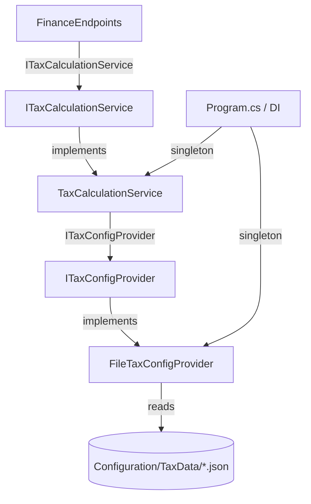

# Design Document: Tax Calculation Service Refactor

## Overview

This refactor introduces a clean abstraction boundary between tax **calculation logic** and tax **configuration loading** in the GradCast API. The goal is to make `TaxCalculationService` unit-testable without ASP.NET hosting infrastructure and to open a seam for future configuration sources (database, remote API, multi-year selection) without touching calculation code.

The change is purely internal to the API layer. The `/api/finance/net-pay` endpoint contract, its inputs, and the `NetPayResult` shape are all unchanged. Existing consumers see no difference.

### Key Design Decisions

- **Interfaces before implementations**: `ITaxCalculationService` and `ITaxConfigProvider` are defined first. All dependencies bind to interfaces, not concrete types.
- **Synchronous `GetConfig()`**: Tax config is loaded once at construction time inside `TaxCalculationService`. Making `GetConfig` async would force `Calculate` to be async too, changing the public API. Since the file read is a one-time startup cost, synchronous loading is the correct trade-off.
- **`TaxConfig` is `public`**: Both test code and `FileTaxConfigProvider` must construct `TaxConfig` instances without reflection. The record must therefore be `public`.
- **Singleton lifetime**: The config is loaded once and shared. Both `ITaxCalculationService` → `TaxCalculationService` and `ITaxConfigProvider` → `FileTaxConfigProvider` are registered as singletons, matching the current `AddSingleton<TaxCalculationService>()` registration.

---

## Architecture

The refactor touches four concerns: the endpoint parameter type, two new interfaces, two (possibly three) service classes, and two DI registrations. Everything else — `NetPayResult`, `LoanAmortizationService`, `BudgetSimulatorService`, the other endpoints — is unchanged.



### Dependency Flow

```
FinanceEndpoints
  └─ ITaxCalculationService
       └─ TaxCalculationService(ITaxConfigProvider)
            └─ FileTaxConfigProvider(IWebHostEnvironment)
                 └─ tax_config_*.json on disk
```

In test code, `FileTaxConfigProvider` is replaced by a hand-crafted stub:

```
TaxCalculationService(StubTaxConfigProvider)
  └─ StubTaxConfigProvider.GetConfig() → new TaxConfig(...)
```

---

## Components and Interfaces

### `ITaxCalculationService`

New interface in `GradCast.Api.Services`.

```csharp
public interface ITaxCalculationService
{
    int TaxYear { get; }
    NetPayResult Calculate(decimal grossAnnualSalary, string state);
}
```

**Rationale**: Minimal surface — mirrors exactly what `FinanceEndpoints` uses. No additional members are needed. This keeps mocking trivial.

---

### `ITaxConfigProvider`

New interface in `GradCast.Api.Services`.

```csharp
public interface ITaxConfigProvider
{
    TaxConfig GetConfig();
}
```

**Rationale**: Single responsibility — provides tax configuration data. Synchronous because config is loaded once. The method name `GetConfig` (not `LoadConfig`) signals that repeated calls are safe and cheap (the loaded config is already in memory for the file provider).

---

### `TaxCalculationService` (modified)

Keeps all existing calculation logic. Constructor changes from `IWebHostEnvironment` to `ITaxConfigProvider`. The private `LoadConfig` static method and the private `TaxConfig`/`TaxBracket` types are removed (replaced by the public shared types). Implements `ITaxCalculationService`.

```csharp
public class TaxCalculationService : ITaxCalculationService
{
    private readonly TaxConfig _config;

    public TaxCalculationService(ITaxConfigProvider configProvider)
    {
        _config = configProvider.GetConfig();
    }

    public int TaxYear => _config.TaxYear;

    public NetPayResult Calculate(decimal grossAnnualSalary, string state) { ... }
    private decimal CalculateFederalTax(decimal taxableIncome) { ... }
}
```

The `Calculate` and `CalculateFederalTax` implementations are copied verbatim from the current service. No formula changes.

---

### `FileTaxConfigProvider` (new)

New class in `GradCast.Api.Services`. Preserves the existing file-loading behavior extracted from `TaxCalculationService.LoadConfig`.

```csharp
public class FileTaxConfigProvider : ITaxConfigProvider
{
    private readonly string _contentRootPath;

    public FileTaxConfigProvider(IWebHostEnvironment env)
    {
        _contentRootPath = env.ContentRootPath;
    }

    public TaxConfig GetConfig()
    {
        var taxDataDir = Path.Combine(_contentRootPath, "Configuration", "TaxData");
        // ... scan, sort descending, parse, return TaxConfig
    }
}
```

The JSON parsing logic and directory-not-found / no-files exception messages are preserved exactly, including the `InvalidOperationException` messages that mention the expected directory path and the "no matching tax configuration files found" message.

---

### `TaxConfig` and `TaxBracket` (promoted to public)

These move from private nested types inside `TaxCalculationService` to public records, likely in the `GradCast.Api.Services` namespace (or a new `GradCast.Api.Configuration` sub-namespace if preferred).

```csharp
public record TaxBracket(decimal UpperBound, decimal Rate);

public record TaxConfig
{
    public int TaxYear { get; init; }
    public decimal StandardDeduction { get; init; }
    public decimal SocialSecurityRate { get; init; }
    public decimal SocialSecurityWageCap { get; init; }
    public decimal MedicareRate { get; init; }
    public IReadOnlyList<TaxBracket> FederalBrackets { get; init; } = [];
    public IReadOnlyDictionary<string, decimal> StateTaxRates { get; init; }
        = new Dictionary<string, decimal>(StringComparer.OrdinalIgnoreCase);
}
```

**Key choices**:
- `IReadOnlyList` and `IReadOnlyDictionary` enforce immutability on the surface. `FileTaxConfigProvider` builds mutable collections internally, then assigns them to these properties.
- `StringComparer.OrdinalIgnoreCase` on the default dictionary supports case-insensitive state code lookup without extra normalization in `Calculate`.
- Both types are `public` so tests can construct them inline with `new TaxConfig { ... }` or `new TaxConfig(...)`.

---

### `FinanceEndpoints` (modified)

Single change: the parameter type of `CalculateNetPay` changes from `TaxCalculationService` to `ITaxCalculationService`. No logic changes.

---

### `Program.cs` (modified)

Two registration changes:

```csharp
// Before
builder.Services.AddSingleton<TaxCalculationService>();

// After
builder.Services.AddSingleton<ITaxConfigProvider, FileTaxConfigProvider>();
builder.Services.AddSingleton<ITaxCalculationService, TaxCalculationService>();
```

Both are singletons. `ITaxConfigProvider` must be registered before `ITaxCalculationService` since `TaxCalculationService`'s constructor depends on it (though ASP.NET DI resolves lazily, ordering in the registration file doesn't matter at runtime — it's convention).

---

## Data Models

### `TaxConfig` record

| Field | Type | Source (JSON key) | Notes |
|---|---|---|---|
| `TaxYear` | `int` | `taxYear` | Calendar year of the tax data |
| `StandardDeduction` | `decimal` | `standardDeduction` | Single-filer standard deduction |
| `SocialSecurityRate` | `decimal` | `socialSecurityRate` | Employee SS rate (e.g., 0.062) |
| `SocialSecurityWageCap` | `decimal` | `socialSecurityWageCap` | SS wage base limit |
| `MedicareRate` | `decimal` | `medicareRate` | Employee Medicare rate (e.g., 0.0145) |
| `FederalBrackets` | `IReadOnlyList<TaxBracket>` | `federalBrackets` | Ordered list of brackets |
| `StateTaxRates` | `IReadOnlyDictionary<string, decimal>` | `stateTaxRates` | State code (uppercase) → flat rate |

### `TaxBracket` record

| Field | Type | Source (JSON key) | Notes |
|---|---|---|---|
| `UpperBound` | `decimal` | `upperBound` | Top of bracket (use `decimal.MaxValue` or a sentinel for the top bracket) |
| `Rate` | `decimal` | `rate` | Marginal rate for income within this bracket |

### `NetPayResult` record (unchanged)

Defined in `GradCast.Api.Models`. All 12 fields remain the same. `TaxCalculationService.Calculate` continues to return the same values for the same inputs.

---

## Correctness Properties

*A property is a characteristic or behavior that should hold true across all valid executions of a system — essentially, a formal statement about what the system should do. Properties serve as the bridge between human-readable specifications and machine-verifiable correctness guarantees.*

### Property 1: Empty bracket list produces zero federal tax

*For any* non-negative `grossAnnualSalary`, when the `TaxConfig` supplied by the provider has a `null` or empty `FederalBrackets` collection, `TaxCalculationService.Calculate` should return a `NetPayResult` with `FederalTaxAnnual` equal to `0` and should not throw.

**Validates: Requirements 2.5**

---

### Property 2: All monetary output fields are rounded to 2 decimal places

*For any* non-negative `grossAnnualSalary`, any state code, and any valid `TaxConfig`, every monetary field in the returned `NetPayResult` (`GrossMonthly`, `FederalTaxAnnual`, `FederalTaxMonthly`, `FicaAnnual`, `FicaMonthly`, `StateTaxAnnual`, `StateTaxMonthly`, `NetAnnual`, `NetMonthly`) should satisfy `Math.Round(field, 2) == field`.

**Validates: Requirements 4.5**

---

### Property 3: Unknown state code applies 4% fallback rate

*For any* non-negative `grossAnnualSalary` and any state code that is not present in `TaxConfig.StateTaxRates`, `StateTaxAnnual` in the returned `NetPayResult` should equal `Math.Round(grossAnnualSalary * 0.04m, 2)`.

**Validates: Requirements 4.4, 5.4**

---

### Property 4: State code lookup is case-insensitive

*For any* non-negative `grossAnnualSalary` and any state code `S` that is present in `TaxConfig.StateTaxRates`, calling `Calculate(grossAnnualSalary, S.ToLower())` and `Calculate(grossAnnualSalary, S.ToUpper())` should produce identical `NetPayResult` values across all fields.

**Validates: Requirements 4.6**

---

### Property 5: Calculation correctness — output matches formula applied to inputs

*For any* non-negative `grossAnnualSalary` and any state code, the `NetPayResult` returned by `TaxCalculationService.Calculate` should equal the result of manually applying the formulas:
- `federalTaxableIncome = Math.Max(0, grossAnnualSalary - config.StandardDeduction)`
- `socialSecurity = Math.Min(grossAnnualSalary, config.SocialSecurityWageCap) * config.SocialSecurityRate`
- `medicare = grossAnnualSalary * config.MedicareRate`
- `stateRate = config.StateTaxRates[state.ToUpperInvariant()] ?? 0.04m`
- `stateTax = grossAnnualSalary * stateRate`
- `netAnnual = grossAnnualSalary - federalTax - fica - stateTax`

with all monetary fields rounded to 2 decimal places.

**Validates: Requirements 4.1, 4.2, 4.3, 5.2**

---

### Property 6: FileTaxConfigProvider always selects the lexicographically largest filename

*For any* non-empty set of filenames matching `tax_config_*.json`, sorting them in descending lexicographic order and selecting the first element should always yield the filename with the highest version string — and calling `GetConfig()` should return the config parsed from that file.

**Validates: Requirements 3.3**

---

### Property 7: State codes are normalized to uppercase during JSON parsing

*For any* valid tax config JSON file where `stateTaxRates` contains state code keys in any mix of cases (e.g., `"ca"`, `"Ca"`, `"CA"`), the `TaxConfig.StateTaxRates` dictionary returned by `FileTaxConfigProvider.GetConfig()` should contain all state codes stored as uppercase strings, and lookups using either case should return the correct rate.

**Validates: Requirements 3.6**

---

## Error Handling

### `FileTaxConfigProvider`

| Condition | Behaviour |
|---|---|
| `Configuration/TaxData/` directory missing | Throw `InvalidOperationException` with message identifying the expected path |
| Directory exists, no `tax_config_*.json` files present | Throw `InvalidOperationException` indicating no matching files |
| Selected JSON file is malformed / missing required field | Let `JsonException` or `InvalidOperationException` propagate (no catch) |

These exceptions propagate through `TaxCalculationService`'s constructor (called during first DI resolution at startup), which causes the host to fail fast with a descriptive error — the desired behavior for a misconfigured deployment.

### `TaxCalculationService`

| Condition | Behaviour |
|---|---|
| `FederalBrackets` is `null` or empty | Return `FederalTaxAnnual = 0` (no throw) |
| State code not in `StateTaxRates` | Apply 4% fallback rate (no throw) |
| `grossAnnualSalary < StandardDeduction` | `federalTaxableIncome` floors to 0 via `Math.Max(0, ...)` |

No changes to error handling in `Calculate` itself; these behaviors are preserved from the current implementation.

---

## Testing Strategy

### Unit Tests (`GradCast.Api.Tests` project, or new `GradCast.Api.Tests` if it doesn't exist)

Specific example-based tests:

- Verify `TaxCalculationService` can be instantiated with `new TaxCalculationService(stubProvider)` — no `IWebHostEnvironment` required.
- Verify `ITaxConfigProvider.GetConfig()` is called by the constructor (use a counting stub).
- Verify `FileTaxConfigProvider` throws `InvalidOperationException` when the tax data directory is missing.
- Verify `FileTaxConfigProvider` throws `InvalidOperationException` when no `tax_config_*.json` files are present.
- Verify `FileTaxConfigProvider` propagates `JsonException` for malformed JSON.
- Verify known salary/state combinations (e.g., $75,000 in CA) produce expected rounded values.
- Verify the SS wage cap edge case: salary above and below `SocialSecurityWageCap`.
- Verify standard deduction floor: salary less than `StandardDeduction` produces `FederalTaxAnnual = 0`.

### Property-Based Tests (using [FsCheck](https://fscheck.github.io/FsCheck/) for .NET)

Each property test runs a minimum of **100 iterations** using randomised inputs.

| Tag | Property | Library |
|---|---|---|
| `Feature: tax-calculation-service-refactor, Property 1: Empty bracket list produces zero federal tax` | Property 1 | FsCheck |
| `Feature: tax-calculation-service-refactor, Property 2: All monetary output fields are rounded to 2 decimal places` | Property 2 | FsCheck |
| `Feature: tax-calculation-service-refactor, Property 3: Unknown state code applies 4% fallback rate` | Property 3 | FsCheck |
| `Feature: tax-calculation-service-refactor, Property 4: State code lookup is case-insensitive` | Property 4 | FsCheck |
| `Feature: tax-calculation-service-refactor, Property 5: Calculation correctness — output matches formula applied to inputs` | Property 5 | FsCheck |
| `Feature: tax-calculation-service-refactor, Property 6: FileTaxConfigProvider always selects the lexicographically largest filename` | Property 6 | FsCheck |
| `Feature: tax-calculation-service-refactor, Property 7: State codes are normalized to uppercase during JSON parsing` | Property 7 | FsCheck |

**Input generators to implement**:
- Non-negative decimal salaries (0 to 10,000,000)
- Valid 2-letter state codes (including known and unknown codes)
- Arbitrary-case variants of known state codes (for Property 4)
- Random sets of `tax_config_*.json` filename strings (for Property 6)
- Random valid `TaxConfig` instances with varying bracket lists and state rate maps
- Well-formed tax config JSON strings with arbitrary state code casing (for Property 7)

**Why FsCheck**: FsCheck is the idiomatic property-based testing library for .NET/C#. It integrates with xUnit via `FsCheck.Xunit` and supports custom generators (`Arb.Generate`). It does not require F# — the C# API (`Prop.ForAll`, `Gen.Choose`, etc.) is sufficient for these properties.

### Integration / Smoke Tests

- Verify DI container resolves `ITaxCalculationService` → `TaxCalculationService` (using `WebApplicationFactory<Program>`).
- Verify DI container resolves `ITaxConfigProvider` → `FileTaxConfigProvider`.
- Smoke-test the `/api/finance/net-pay` endpoint with a representative salary/state to confirm the wiring works end-to-end after the refactor.
