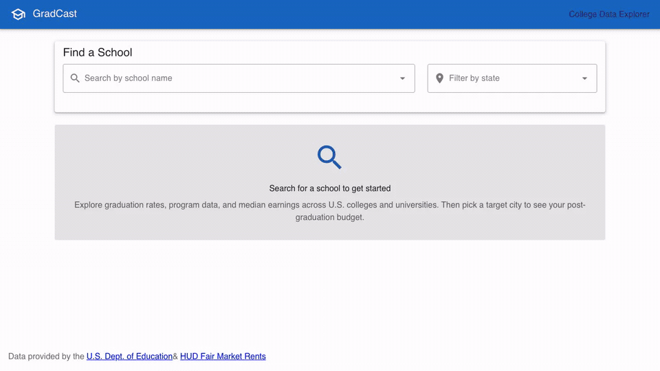

# GradCast

[](https://gradcast.fly.dev)

An AI-generated proof-of-concept web application that helps students simulate their financial future after graduation — based on real college costs, program-level earnings data, local housing markets, and tax calculations. Built on the U.S. Department of Education's [College Scorecard API](https://collegescorecard.ed.gov/data/api/) and HUD Fair Market Rent data.

<p align="center">
  
  <br>
  <em>Interactive walkthrough of the progressive disclosure flow (search &rarr; program &rarr; city &rarr; live budget consequences).</em>
  <br>
  <sub>📺 <a href="docs/assets/gradcast-walkthrough.mp4">Watch high-definition MP4 walkthrough (720p)</a></sub>
</p>

## Tech Stack

- **Backend**: C# / ASP.NET Core 10 Minimal API
- **Frontend**: Vue 3 (Composition API) + TypeScript + Vuetify 4 + Pinia
- **Testing**: Playwright (Frontend E2E) + xUnit (.NET Backend)
- **Data Layer**: SQLite via Dapper / Microsoft.Data.Sqlite (local/hybrid mode) or live API calls (remote mode)
- **Build**: .NET CLI + Vite

## Features

### Phase 1: College Data Explorer
- Type-ahead school search with optional state filtering
- School overview: admission rate, enrollment, tuition, completion rate
- Program-level data grouped by CIP category (department)
- Median earnings (1 year post-graduation) per program
- 5-year tuition trend line chart (in-state vs. out-of-state)
- Year selector for historic data with completeness tooltip

### Phase 2: Budget Simulator ("The Consequences Engine")
- **Progressive disclosure UX**: each step reveals the next, guiding the user through choices
- **Program selection**: click any program row to use its earnings data in the simulation
- **Target destination picker**: search 156 US metro areas with housing type toggle (live alone / roommate)
- **Job Market Pulse**: live job openings, local median salary, and Scorecard earnings comparison via Adzuna API (matched by CIP program category and target metro area)
- **Post-Grad Monthly Budget Simulator**:
  - Net take-home pay (federal + state taxes + FICA)
  - Rent from HUD Fair Market Rents (by metro + housing type)
  - Student loan payment (standard 10-year amortization from estimated debt)
  - Disposable income with status indicator (comfortable / manageable / tight / deficit)
  - Budget split percentage bars
  - Salary override for what-if scenarios
- **Saved Scenarios**: name and save budget simulations to localStorage for comparison

### Data Modes
- **`hybrid`** (default): Local DB for imported data, API fallback for historic years
- **`local`**: All requests query local SQLite database only
- **`api`**: All Scorecard requests go to the live API

## User Flow

```
1. Search for a school          → Type-ahead autocomplete
2. View school details          → Tuition, admission rate, completion rate, trend chart
3. Browse/select a program      → Click to lock in earnings data (optional)
4. Pick target destination      → Metro area + housing preference
5. Job market pulse appears     → Active job openings & local salary vs. Scorecard earnings
6. Budget simulator appears     → Real numbers, real consequences
7. Save scenarios               → Compare different school/city/program combinations
```

## Getting Started

### Quickest Start ("Just Run")

GradCast includes zero-friction options so you can run the app immediately without downloading 470 MB datasets or manually managing multiple terminals:

#### Option 1: Docker Compose (Zero local SDKs required)
Runs both the backend API and frontend SPA in a single container with auto-seeded reference data:
```bash
docker compose up --build
```
- Open **http://localhost:5062** in your browser.
- Health check: `http://localhost:5062/health`
- Database is persisted in the `gradcast-data` volume. (To mount an existing local `gradcast.db`, see the volume comment in `docker-compose.yml`).
- Optional: set `COLLEGE_SCORECARD_API_KEY` and `ADZUNA_APP_ID`/`ADZUNA_APP_KEY` in your environment or a `.env` file for remote data fallback and live job pulses.

#### Option 2: One-Command Local Script (`./start.sh`)
For local development on macOS/Linux:
```bash
./start.sh
```
What `./start.sh` does:
- Validates `.NET 10 SDK` and `Node.js 20+` prerequisites.
- Installs `npm` dependencies automatically if `node_modules` is missing.
- Checks for port conflicts on `5062` and `5173`.
- Auto-seeds reference data (`gradcast.db`) on API startup if missing.
- Launches both the API (`http://localhost:5062`) and Vite dev server (`http://localhost:5173`) with hot reloading, and cleanly terminates both processes on `Ctrl+C`.

**Additional script modes:**
```bash
./start.sh --single     # Builds frontend into dist and runs unified single-process ASP.NET server (port 5062)
./start.sh --api-only   # Runs backend API only (port 5062)
```

#### Option 3: GitHub Codespaces / Dev Container
1. Open this repository on GitHub.
2. Click **Code → Codespaces → Create codespace on main**.
3. Once the environment loads, run `./start.sh` in the terminal.
4. Ports `5062` (API) and `5173` (Web) are forwarded automatically for browser preview.

---

### Prerequisites (For Manual Local Development)

- [.NET 10 SDK](https://dotnet.microsoft.com/download)
- [Node.js 20+](https://nodejs.org/)
- A free API key from [api.data.gov](https://api.data.gov/signup/) (required for `api` and `hybrid` modes)
- (Optional) Free API credentials from [developer.adzuna.com](https://developer.adzuna.com/) (for live Job Market Pulse data)

### Quick Start (Hybrid Mode — Recommended)

1. Clone the repo:
   ```bash
   git clone https://github.com/knowthankyew/gradcast.git
   cd gradcast
   ```

2. Download College Scorecard data from [collegescorecard.ed.gov/data](https://collegescorecard.ed.gov/data) — click "All Data Files Download (.zip, 470 MB)"

3. Import the data:
   ```bash
   dotnet run --project src/import -- ~/Downloads/CollegeScorecard_Raw_Data.zip
   ```
   This creates `gradcast.db` with schools, programs, metro areas, and housing costs.

4. Configure API keys (optional — Scorecard API for remote/hybrid fallback, Adzuna for live job pulse):
   
   **Option A: .NET User Secrets (Recommended for local dev)**
   ```bash
   dotnet user-secrets set "CollegeScorecard:ApiKey" "YOUR_SCORECARD_KEY" --project src/api
   dotnet user-secrets set "Adzuna:AppId" "YOUR_ADZUNA_APP_ID" --project src/api
   dotnet user-secrets set "Adzuna:AppKey" "YOUR_ADZUNA_APP_KEY" --project src/api
   ```

   **Option B: Environment Variables**
   ```bash
   # Standard ASP.NET Core hierarchical naming
   export CollegeScorecard__ApiKey="YOUR_SCORECARD_KEY"
   export Adzuna__AppId="YOUR_ADZUNA_APP_ID"
   export Adzuna__AppKey="YOUR_ADZUNA_APP_KEY"

   # Or flat naming
   export COLLEGE_SCORECARD_API_KEY="YOUR_SCORECARD_KEY"
   export ADZUNA_APP_ID="YOUR_ADZUNA_APP_ID"
   export ADZUNA_APP_KEY="YOUR_ADZUNA_APP_KEY"
   ```

   **Option C: Local Configuration File**
   ```bash
   cp src/api/appsettings.Development.example.json src/api/appsettings.Development.json
   # Edit src/api/appsettings.Development.json with your keys (gitignored)
   ```

5. Run the API (hybrid mode is enabled by default):
   ```bash
   dotnet run --project src/api
   ```
   API starts on `http://localhost:5062`

6. Run the frontend (in a separate terminal):
   ```bash
   cd src/web
   npm install
   npm run dev
   ```
   App starts on `http://localhost:5173`

7. Open `http://localhost:5173` and explore.

### Quick Start (API-only Mode — No Import Needed)

If you just want to try it without downloading the bulk data:

```bash
# Configure your API key (see step 4 above), then:
dotnet run --project src/import -- --seed-only  # Creates empty DB with metro/FMR seed data
dotnet run --project src/api
cd src/web && npm install && npm run dev
```

Note: Budget simulations require the imported metro/housing data (seeded automatically), but school data will come from the live API.

## Import Tool

```bash
# Point at the downloaded Scorecard zip
dotnet run --project src/import -- ~/Downloads/CollegeScorecard_Raw_Data.zip

# Or an extracted directory
dotnet run --project src/import -- ~/Downloads/scorecard_data/

# Seed reference data only (no bulk data download required)
dotnet run --project src/import -- --seed-only

# Custom database path
dotnet run --project src/import -- ~/Downloads/CollegeScorecard_Raw_Data.zip ./custom.db
```

The import is idempotent and also seeds:
- **156 CBSA metro areas** (Census Bureau delineation data)
- **FY2025 Fair Market Rents** for all metros (HUD data)

## Project Structure

```
gradcast/
├── src/
│   ├── api/                              # ASP.NET Core 10 backend
│   │   ├── Program.cs                    # DI, middleware, endpoint mapping
│   │   ├── Configuration/                # Options classes & tax configuration
│   │   │   ├── CollegeScorecardOptions.cs
│   │   │   ├── AdzunaOptions.cs
│   │   │   └── TaxData/
│   │   │       └── tax_config_2026.json  # Versioned federal/state tax brackets
│   │   ├── Endpoints/                    # Minimal API route handlers
│   │   │   ├── SchoolEndpoints.cs        # /api/schools/*
│   │   │   ├── LocationEndpoints.cs      # /api/locations/*
│   │   │   ├── FinanceEndpoints.cs       # /api/finance/*
│   │   │   └── JobEndpoints.cs           # /api/jobs/*
│   │   ├── Models/                       # DTOs
│   │   └── Services/                     # Business logic
│   │       ├── ICollegeScorecardService.cs
│   │       ├── CollegeScorecardService.cs      # Remote Scorecard API
│   │       ├── LocalCollegeScorecardService.cs # SQLite queries
│   │       ├── HybridCollegeScorecardService.cs
│   │       ├── LocationService.cs              # Metro area search
│   │       ├── HousingCostService.cs           # HUD FMR lookup
│   │       ├── TaxCalculationService.cs        # Federal + state tax math
│   │       ├── LoanAmortizationService.cs      # Student loan payments
│   │       ├── IJobPulseService.cs             # Job pulse contract
│   │       ├── AdzunaJobPulseService.cs        # Live job openings via Adzuna
│   │       ├── CipJobKeywordMap.cs             # CIP code to job search keywords
│   │       └── BudgetSimulatorService.cs       # Orchestrates the full sim
│   ├── api.tests/                        # xUnit backend test suites
│   │   ├── Configuration/                # Options binding & DI registration tests
│   │   ├── Data/                         # Reference data seeder integration tests
│   │   ├── Endpoints/                    # Route contracts & API validation tests
│   │   ├── Services/                     # Service unit tests (Budget, Tax, Loan, etc.)
│   │   └── TestDoubles/                  # Shared test doubles & stubs
│   ├── data/                             # SQLite data layer (Dapper & connection factory)
│   │   ├── Entities/                     # School, Program, CbsaLocation, FairMarketRent, etc.
│   │   ├── SeedData/                     # Static seed (metros + FMR values)
│   │   ├── ISqliteConnectionFactory.cs   # Connection factory interface
│   │   ├── SqliteConnectionFactory.cs    # Connection factory with WAL pragmas
│   │   └── SqliteDatabaseInitializer.cs  # Schema DDL & covering index creation
│   ├── import/                           # CLI import tool
│   │   └── Program.cs                    # Bulk Scorecard import & reference data seeder
│   └── web/                              # Vue 3 + Vuetify 4 frontend
│       ├── e2e/                          # Playwright end-to-end tests
│       │   ├── fixtures/mockData.ts      # Deterministic route mocks
│       │   ├── gradcast-flow.spec.ts     # Core progressive disclosure flow
│       │   ├── saved-scenarios.spec.ts   # Scenario persistence & hydration
│       │   └── what-if-scenarios.spec.ts # Salary override & state integrity
│       ├── playwright.config.ts          # Playwright test configuration
│       └── src/
│           ├── components/               # UI components
│           │   ├── DisclaimerBanner.vue  # Legal/data disclaimer banner
│           │   ├── SchoolSearch.vue
│           │   ├── SchoolDetail.vue
│           │   ├── ProgramList.vue       # Selectable program rows
│           │   ├── YearSelector.vue      # Historic data year selector
│           │   ├── TuitionTrend.vue      # 5-year tuition history chart
│           │   ├── LocationSelector.vue  # Metro + housing type
│           │   ├── JobPulseWidget.vue    # Active openings & salary comparison
│           │   ├── BudgetSimulator.vue   # The "consequences engine"
│           │   └── SavedBudgets.vue      # localStorage scenarios
│           ├── composables/              # API + logic composables
│           │   ├── useSchoolApi.ts
│           │   ├── useBudgetSimulator.ts
│           │   ├── useJobPulse.ts
│           │   └── useSavedBudgets.ts
│           ├── stores/                   # Pinia state management
│           │   └── appStore.ts           # Shared state + isRestoring mutex
│           ├── data/                     # Static lookup data (CIP categories)
│           │   └── cipCategories.ts
│           └── types/                    # TypeScript interfaces
├── GradCast.slnx                         # .NET solution
└── README.md
```

## Testing

### Frontend (Playwright E2E)
The frontend includes end-to-end test suites powered by Playwright with realistic network mocking:

```bash
cd src/web
npm run test:e2e        # Run all tests headless
npm run test:e2e:ui     # Interactive UI mode with DOM inspection and time-travel debugging
npm run test:e2e:headed # Run in visible browser window
npm run demo:record     # Re-record demo & generate optimized GIF and MP4
npm run demo:record:headed # Run demo recorder in a visible browser window
```

Test coverage:
- **Core User Flow**: Progressive disclosure from school search to full budget simulation.
- **Saved Scenarios**: Saving, reloading/hydrating from empty state, deleting, and bulk clearing.
- **What-If Simulations**: Salary overrides, scorecard median resets, and historic year selector resilience.

### Backend (xUnit)
```bash
dotnet test
```

## Deployment (Fly.io)

GradCast is configured for single-machine containerized deployment to [Fly.io](https://fly.io/) backed by a persistent Fly Volume for SQLite:

1. **Launch App**:
   ```bash
   fly launch --no-deploy
   ```
2. **Provision Persistent Volume**:
   ```bash
   fly volumes create gradcast_data --region dfw --size 1
   ```
3. **Set Optional API Secrets**:
   ```bash
   fly secrets set COLLEGE_SCORECARD_API_KEY=your_key ADZUNA_APP_ID=your_id ADZUNA_APP_KEY=your_key
   ```
4. **Deploy**:
   ```bash
   fly deploy
   ```

Live instance is accessible at **https://gradcast.fly.dev**.

## API Endpoints

| Method | Path | Description |
|--------|------|-------------|
| GET | `/api/schools/search?q={name}&state={ST}` | Search schools |
| GET | `/api/schools/{id}?year={year}` | School detail with programs |
| GET | `/api/schools/{id}/tuition-trend` | 5-year tuition history |
| GET | `/api/locations/search?q={query}` | Search metro areas |
| GET | `/api/locations/{cbsa}/housing?type=1bed\|2bed` | Fair Market Rent |
| GET | `/api/finance/net-pay?grossSalary=&state=` | Net pay calculator |
| GET | `/api/finance/loan-payment?principal=&rate=&termYears=` | Loan amortization |
| POST | `/api/finance/simulator` | Full budget simulation |
| GET | `/api/jobs/pulse?cipCode={cip}&cbsa={cbsa}` | Live job openings & salary data |

## Phase 3 Vision

- Multi-year career trajectory modeling
- Side-by-side school/city comparison mode
- Savings rate projections and emergency fund timelines
- Geographic arbitrage suggestions (same degree, different cities)

## Data Sources

| Source | Data | Update Frequency |
|--------|------|-----------------|
| [College Scorecard](https://collegescorecard.ed.gov/) | Schools, programs, earnings, completion rates | Annual |
| [HUD Fair Market Rents](https://www.huduser.gov/portal/datasets/fmr.html) | Rent by metro area | Annual |
| Census Bureau | CBSA metro area delineations | Decennial+ |
| Federal tax brackets | Income tax calculations | Annual (hardcoded) |
| [Adzuna](https://developer.adzuna.com/) | Job openings & local salaries by CIP/metro | Real-time API |

## License

MIT
